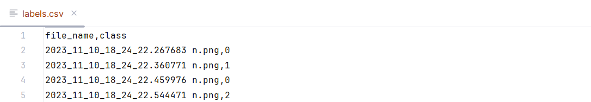

# CZ4042: Neural Network and Deep Learning Course Project

## Brief Introduction

* Develop an endless runner game with Python and PyGame
* Train an AI model with EfficientNetV2-S to play the game

> Clone this repository, and refer to section 6 (Installation Guide) of the [report](CZ4042_ProjectReport.pdf) to get started.

## RunLah PyGame Application

RunLah is an endless runner game developed from scratch with PyGame, where the player-controlled
game avatar continuously moves forward through a side-scrolling landscape, while dodging obstacles of
varying difficulty to achieve the best possible score.

To run the game, run the following command:

<code>python .\RunLahGame\RunLahGame.py</code>

## RunLahAI Game Bot Training Procedure

This repository provide the top-performing model <code>efficientnet_s_20E_8BS.pth</code> from the training process.
If you would to just see the model in action, go to the [RunLahAI Game Bot Plays RunLah](#runlahai-game-bot-plays-runlah) section below.
Else, if you would like to train your own model, follow the steps below.

### Dataset Acquisition 

---

To run the dataset preparation code solution to obtain the game screenshots, make sure RunLah
is running and run the following command:

<code>python .\capture_runlah_gameplay.py</code>

### Dataset Processing

---

To run the dataset processing code solution to obtain the <code>labels.csv</code> file with the image filenames and
their associated labels, run the following command:

<code>python .\process_dataset.py</code>

### Training the AI Game Bot

---

To run the training code solution, run the following command:

<code>python -m notebook</code>

Once Jupyter is open, navigate to the <code>train_RunLahAI.ipynb</code>, and <code>“Run All Cells”</code>.

> Remember to change the number of epochs and/or batch size in the .ipynb file to your desired value.

## RunLahAI Game Bot Plays RunLah

To run the RunLahAI bot to play RunLah, make
sure RunLah is running and run the following command:

<code>python .\runlahAIbot.py</code>

> To see the qualitative results of the RunLahAI Game Bot 
> for different number of epochs and batch sizes, 
> click [here](https://youtu.be/Nfv52699phw).

 

## References

Resolving PyGame application keyboard-related issues (Using DirectInput):
https://www.youtube.com/watch?v=LFDGgFRqVIs
